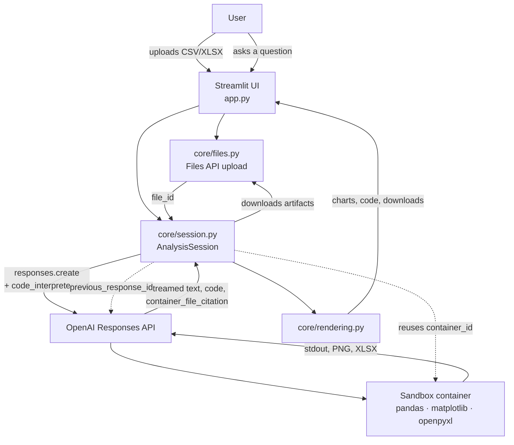

# Agentic Data Analyst

Ask questions about a spreadsheet in plain English and get back charts, findings, and
downloadable reports. The model writes and runs real Python against your data in a
sandbox — it is not summarising the file, it is analysing it.

> Upload two years of solar generation data, ask *"find anomalies in this data"*, and it
> loads the CSV, profiles it, spots the nine-day outage at one site and the inverter
> that has been quietly degrading since March, and hands you a chart of each.

## Why this is interesting

A chatbot that reads a CSV as text can only tell you what it can see in the tokens.
This one is an **agent**: it plans an analysis, writes pandas and matplotlib code, runs
it in an OpenAI-hosted container, reads its own errors, corrects them, and keeps going
until it has an answer. The sandbox persists across the conversation, so a follow-up
question builds on the dataframes the previous answer already loaded rather than
starting from scratch.

## What it does

- **Plain-English analysis** — no query language, no chart configuration
- **Real code execution** — pandas, numpy, scipy, scikit-learn, matplotlib in a sandbox
- **Charts and reports** — PNGs render inline; Excel and PDF exports come back as downloads
- **Conversational** — "now break that down by site" works, and reuses the loaded data
- **Self-correcting** — when its code raises, it reads the traceback and fixes it
- **Transparent** — every cell of code it ran is one click away under each answer
- **Cost aware** — a running spend estimate for the session sits in the sidebar

## Architecture



Two pieces of server-side state carry the conversation:

| State | Purpose | On expiry |
| --- | --- | --- |
| `previous_response_id` | The model remembers the conversation without resending the transcript | Responses are retained 30 days |
| `container_id` | The sandbox keeps its loaded dataframes and variables between turns | Expires after 20 min idle — the app silently rebuilds it, re-mounts the files, and retries once |

## Running it

Requires Python 3.10+ and an [OpenAI API key](https://platform.openai.com/api-keys).

```powershell
py -m venv .venv
.\.venv\Scripts\Activate.ps1
pip install -r requirements.txt

Copy-Item .env.example .env    # then paste your key into .env
python scripts\make_sample_data.py

streamlit run app.py
```

Verify the API path end to end before touching the UI:

```powershell
python scripts\smoke_test.py --follow-up
```

That uploads the sample dataset, asks a real question, confirms the model ran code and
produced a chart, downloads it to `outputs/`, and checks that the second question
reused the same sandbox. It fails with a specific reason rather than leaving you to
debug through the browser.

## The sample dataset

`scripts/make_sample_data.py` generates two years of daily generation across five solar
sites, with four faults deliberately planted so there is something real to find:

| Site | Planted fault |
| --- | --- |
| SITE_C | Nine-day total outage in July 2025 |
| SITE_D | Inverter degradation worsening from March 2025 |
| SITE_A | Four missing generation readings (sensor dropout) |
| SITE_E | One impossible reading, 2.4× plant capacity |

Good questions to demo with: *"What's in this dataset?"*, *"Show me the monthly trend"*,
*"Find anomalies or data quality problems"*, *"Which site is underperforming and why?"*

## Project layout

```
app.py                      Streamlit UI: sidebar, chat, streaming
core/config.py              Model, sandbox size, limits, pricing table
core/openai_client.py       Key resolution (.env, secrets, env var) and client
core/prompts.py             The analyst persona and canned prompts
core/files.py               Files API upload, artifact download, filename safety
core/session.py             The turn loop: container reuse, expiry recovery, parsing
core/rendering.py           TurnResult -> Streamlit widgets
scripts/make_sample_data.py Synthetic dataset generator
scripts/smoke_test.py       UI-free end-to-end verification
```

## Choosing a model

`core/config.py` has a single `MODEL` constant. It defaults to `gpt-4.1`.

A note worth knowing: the model id `gpt-4` is the original 2023 release, and its model
card lists function calling as unsupported — it cannot drive the code interpreter tool,
so this app will not run on it. `gpt-4.1` is the current GPT-4 generation and works.
`gpt-5.6-terra` and `gpt-5.6-luna` also support the tool if you want to compare.

## Cost

At `gpt-4.1` ($2.00 in / $8.00 out per million tokens), a typical question costs roughly
**$0.02–$0.10**; a heavy multi-chart report turn runs **$0.20–$0.50**. The sandbox bills
per 20-minute session by memory tier — this app requests 4 GB at $0.12, since 1 GB gets
tight once pandas copies a frame.

Chained conversations re-bill earlier input tokens on every turn, so a long session
costs more per question than a short one. **Start a new analysis** in the sidebar is the
cost control as much as it is the reset button.

## Deploying

On [Streamlit Community Cloud](https://share.streamlit.io): push the repo (`.env` is
gitignored), then add `OPENAI_API_KEY` under **Settings → Secrets**. No code change is
needed — `core/openai_client.py` already checks Streamlit secrets before the environment.

If you are sharing the link publicly, the sidebar has a **bring-your-own-key** field so
visitors spend against their own account rather than yours.

## Limitations

- Uploaded data is sent to OpenAI. Do not use it with anything confidential.
- Very large files exhaust the sandbox; aggregate before uploading past ~50 MB.
- The sandbox has no internet access, so the model cannot fetch reference data.
- Findings are generated. Spot-check anything you plan to act on — the code is shown
  under every answer precisely so you can.
